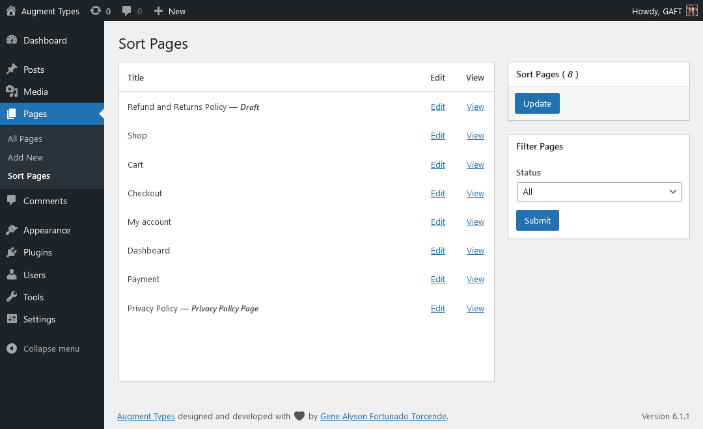
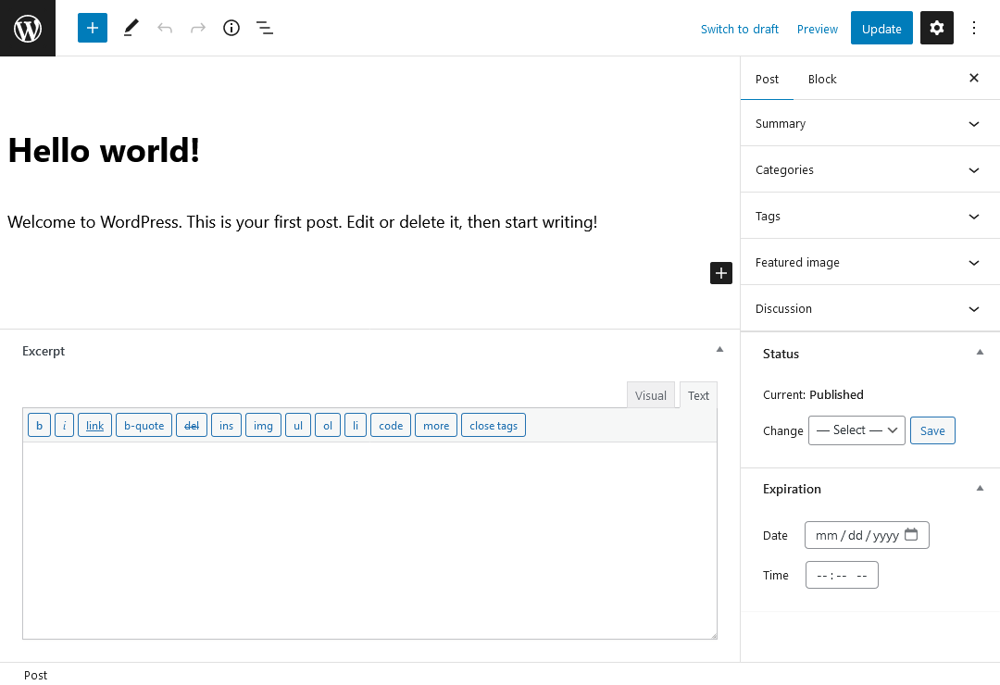
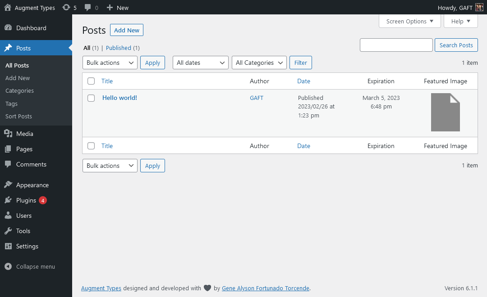

# Augment Types

Stable tag: 1.18.0 
Tested up to: 6.5.99  
Requires at least: 4.6  
Requires PHP: 5.6  
License: GPLv3  
Tags: order/sort, archive, featured image, excerpts, expiration  
Contributors: gaft  
Donate link: https://www.paypal.me/GAFT

 

## Description

Add essential functionalities to WordPress Post Types

## Features

- Intuitive drag-and-drop sorting
- Straightforward content archiving
- Easy inline edits of featured images
- Classic TinyMCE for exciting excerpts
- Simple post expirator by date and time
- Correct taxonomy term count per post type

## Screenshots

1. The sorting page
   

2. The editing page
   

3. The listing page
   

## Changelog

Please follow the [Github Releases](https://github.com/kermage/augment-types/releases)
